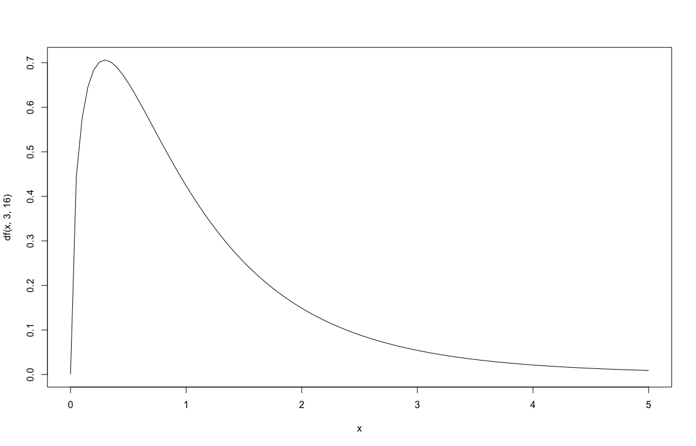

# 一元配置分散分析(対応なし)

『Rによるやさしい統計学』7章の範囲の備忘録です.
## 1. 帰無仮説と対立仮説

>$H_0$ 複数郡の母平均は全て等しい\
>$H_1$ 複数郡の母平均は全て等しくない

複数郡でひとつでも母平均が異なるならば、帰無仮説を棄却し対立仮説を採択する.


## 2. 検定統計量
検定統計量Fの求め方
$$
F = \frac{\frac{群間平方和}{群間自由度}}{\frac{郡内平方和}{郡内自由度}}
$$
検定統計量Fは帰無仮説(母平均は全て等しい)のもとで、F分布という分布確率に従う\
\
\
  

- 上図は分子の自由度3, 分母の自由度16のF分布
```R
curve(df(x, 3, 16), 0, 5)
#df(x, 分子の自由度, 分母の自由度)
```


## 3. 有意水準の決定
各々で有意水準を決定する. 今回は5%とする. $\alpha=0.05$

 ## 4. 検定統計量Fを求める　
 分散分析を行うための関数
 - oneway.test関数
 - aov関数
 - anova関数
 の3種類がある.


```R
#サンプルデータ
A <- c(15, 9, 18, 14, 18)
B <- c(13, 8, 8, 12, 7)
C <- c(10, 6, 11, 7, 12)
D <- c(10, 7, 3, 5, 7)

統計テスト2 <- c(A, B, C, D)
指導法 <- c(rep("A", 5), rep("B", 5), rep("C", 5), rep("D", 5))
指導法2 <- factor(指導法)
```
1. oneway.test
```R
oneway.test(統計テスト2 ~ 指導法2, var.equal = TRUE)

---------------
	One-way analysis of means

data:  統計テスト2 and 指導法2
F = 7.1111, num df = 3, denom df = 16, p-value = 0.002988
```
2. aov
```R
summary(aov(統計テスト2 ~ 指導法2))

--------------
            Df Sum Sq Mean Sq F value  Pr(>F)   
指導法2      3    184   61.33   7.111 0.00299 **
Residuals   16    138    8.63                   
---
Signif. codes:  0 ‘***’ 0.001 ‘**’ 0.01 ‘*’ 0.05 ‘.’ 0.1 ‘ ’ 1
```
3. anova
```R
anova(lm(統計テスト2 ~ 指導法2))

-------------
Analysis of Variance Table

Response: 統計テスト2
          Df Sum Sq Mean Sq F value   Pr(>F)   
指導法2    3    184  61.333  7.1111 0.002988 **
Residuals 16   138   8.625                    
---
Signif. codes:  0 ‘***’ 0.001 ‘**’ 0.01 ‘*’ 0.05 ‘.’ 0.1 ‘ ’ 1
```
各関数で検定統計量Fは7.111である.

## 5. 帰無仮説の棄却か採択
各出力結果のp-valueを確認します. ここではp-valueは0.002988で、0.05より小さいことがわかる.
つまり5%の水準では4つの群(A~D)で有意な平均偏差を確認できる.